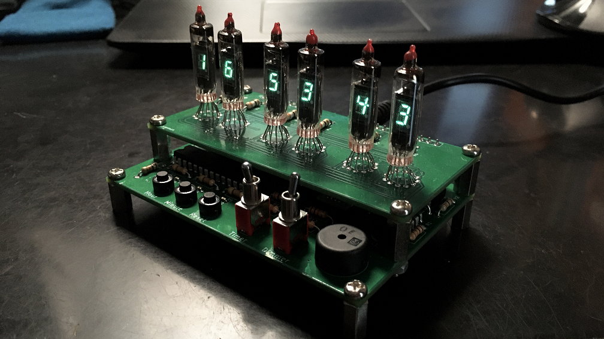

# VFD-Clock
This is a project for a table clock using a VFD.  
For more information, please visit [this site.](https://ice458.wordpress.com/%e5%ae%9f%e7%94%a8%e7%9a%84%e3%81%aavfd%e6%99%82%e8%a8%88/)  
  

## License

The files contained in [VFD2.X/mcc_generated_files](VFD2.X/mcc_generated_files) are copyrighted by Microchip. The code can only be used in Microchip products. Please refer to the comments at the top of the files for details.

Other files are subject to the overall license [LICENSE](LICENSE).

